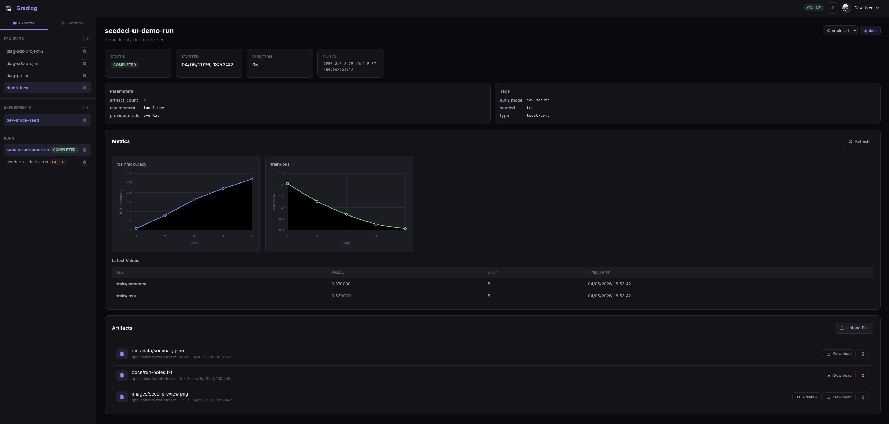

<p align="center">
	
</p>

<h1 align="center">Gradlog</h1>

<p align="center">
	Self-hosted ML experiment tracking with built-in authentication, project membership, API keys, metrics, and artifact management.
</p>

<p align="center">
	
</p>

Gradlog is a lightweight experiment tracker for teams that want a smaller operational footprint than a large Python web stack while still getting real multi-user access control.

It runs as a single Go service backed by PostgreSQL and serves the web UI directly from the backend binary.

## Why Gradlog

- Built-in auth and project membership for multi-user teams
- Single backend service with embedded UI
- Metrics, parameters, tags, runs, and artifact tracking
- API key support for SDKs and automation
- Straightforward self-hosting with Docker Compose

## Architecture

- Backend: Go + Gin
- Database: PostgreSQL
- Auth: Google OAuth or local dev auth bypass
- UI: Static assets embedded into the backend binary
- SDK: Python client for logging runs, metrics, and artifacts

## Quick Start

1. Copy the environment template:

```bash
cp gradlog/.env.example gradlog/.env
```

2. For quick local development, enable local auth bypass in `gradlog/.env`:

```env
DEV_NOAUTH_EMAIL=dev@localhost
```

3. Start the stack:

```bash
docker compose up --build
```

4. Open Gradlog:

- App: `http://localhost:8080/`
- Health: `http://localhost:8080/health`

## Local Development Demo Data

To populate a local development instance with a sample project, experiment, run, metrics, and artifacts including a PNG image:

```bash
make seed-local-dev
```

This creates:

- Project: `demo-local`
- Experiment: `dev-mode-seed`
- Run: `seeded-ui-demo-run`
- Metrics: sample `train/loss` and `train/accuracy` values
- Artifacts:
	`images/seed-preview.png`
	`docs/run-notes.txt`
	`metadata/summary.json`

The seed script is designed to work with `DEV_NOAUTH_EMAIL` enabled, so you can bring up localhost and immediately inspect the UI without configuring Google OAuth first.

## Authentication Modes

### Local dev mode

Use this when you want to test the app locally without a login flow:

```env
DEV_NOAUTH_EMAIL=dev@localhost
FRONTEND_URL=http://localhost:8080
```

When enabled, every request is treated as authenticated as that synthetic user. This is only for local development and should never be used in production.

### Google OAuth mode

If you want to test the real login flow, set these values in `gradlog/.env`:

- `GOOGLE_CLIENT_ID`
- `GOOGLE_CLIENT_SECRET`
- `GOOGLE_REDIRECT_URL`

For a production domain such as `your-domain.com`, configure Google OAuth with:

- Authorized JavaScript origin: `https://your-domain.com`
- Authorized redirect URI: `https://your-domain.com/api/v1/auth/google/callback`

And set:

```env
GOOGLE_REDIRECT_URL=https://your-domain.com/api/v1/auth/google/callback
FRONTEND_URL=https://your-domain.com
```

## Frontend Delivery

Gradlog serves the UI directly from the backend. Static assets live under `gradlog/internal/ui/dist` and are embedded into the Go binary at build time.

That means a single service provides both the API and the web application.

## Python SDK

The Python SDK lives under `sdk/python` and supports creating projects, experiments, runs, metrics, and artifacts.

Install it locally with:

```bash
cd sdk/python
pip install -e .
```

Example:

```python
import gradlog

client = gradlog.Client(host="http://localhost:8080")
project = client.get_or_create_project("demo-local")
experiment = project.get_or_create_experiment("dev-mode-seed")

with experiment.start_run(name="example-run") as run:
		run.log_metric("loss", 0.42, step=1)
```

## Gradlog vs MLflow

Gradlog is intentionally opinionated toward smaller, auth-aware self-hosting.

- Smaller deployment footprint
- Backend implemented in Go
- Built-in project membership and API-key flows
- API and UI served from one binary

MLflow remains a good choice when you need its broader ecosystem integrations. Gradlog is aimed at teams that want a simpler self-hosted tracker with built-in access control.

## Notes

- `JWT_SECRET` is not used.
- If OAuth is not configured, API-key auth still works.
- The local dev seed path assumes the server is available at `http://localhost:8080` unless `GRADLOG_HOST` is set.

## Licensing

Gradlog is dual-licensed.

- Open source use: GNU GPL v3, see [LICENSE](LICENSE)
- Commercial use: see [LICENSE-COMMERCIAL](LICENSE-COMMERCIAL)

A commercial license is required for uses such as:

- Closed-source or proprietary distribution
- Hosted or managed SaaS offerings
- Internal commercial platforms that do not comply with GPL v3 obligations

For commercial licensing, contact `gradlog@efesirin.com`.

## Contributing

Pull requests are welcome.
